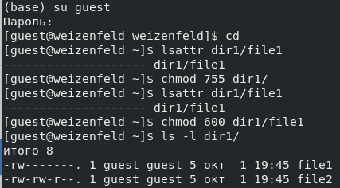
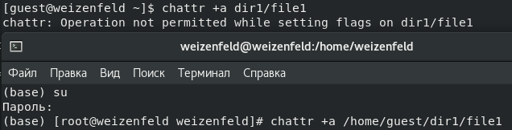
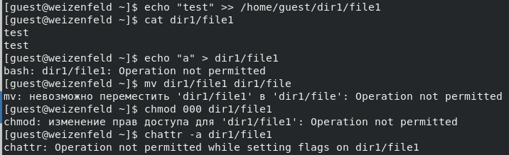
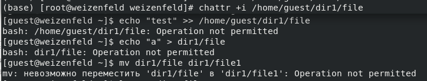

---
## Front matter
lang: ru-RU
title: Отчёт по лабораторной работе №4
subtitle: Дискреционное разграничение прав в Linux. Расширенные атрибуты
author:
  - Вейценфельд Д. А.
institute:
  - Российский университет дружбы народов, Москва, Россия
date: 01 октября 2022

## i18n babel
babel-lang: russian
babel-otherlangs: english

## Formatting pdf
toc: false
toc-title: Содержание
slide_level: 2
aspectratio: 169
section-titles: true
theme: metropolis
header-includes:
 - \metroset{progressbar=frametitle,sectionpage=progressbar,numbering=fraction}
 - '\makeatletter'
 - '\beamer@ignorenonframefalse'
 - '\makeatother'
---

## Цель

Получение практических навыков работы в консоли с расширенными
атрибутами файлов

## Подготовка файла

:::::::::::::: {.columns align=center}
::: {.column width="70%"}

- Выполнен вход от другого пользователя
- Установлены атрибуты прав 600 на нужный файл

:::
::: {.column width="30%"}

:::
::::::::::::::

## Установка специального атрибута на файл

:::::::::::::: {.columns align=center}
::: {.column width="70%"}

- Специальный атрибут `a` ограничивает пользователей, позволяя только запись в конец файла.
- Удаление, изменение имени, перезапись - запрещены

:::
::: {.column width="30%"}

:::
::::::::::::::

## Проверка файла с атрибутом а

## Специальный атрибут i

:::::::::::::: {.columns align=center}
::: {.column width="50%"}

- Означает immutable
- Запрещает всем пользователям изменять файл
- Менять эти атрибуты может только суперпользователь (root)

:::
::: {.column width="50%"}

:::
::::::::::::::

## Вывод

В результате выполнения работы повысил свои навыки использования интерфейса командой строки (CLI), познакомился на примерах с тем,
как используются расширенные атрибуты при разграничении доступа.
