---
## Front matter
title: "Отчёт по лабораторной работе №4"
subtitle: "Дискреционное разграничение прав в Linux. Расширенные атрибуты"
author: "Даниил Анатольевич Вейценфельд"

## Generic otions
lang: ru-RU
toc-title: "Содержание"

## Bibliography
bibliography: bib/cite.bib
csl: pandoc/csl/gost-r-7-0-5-2008-numeric.csl

## Pdf output format
toc: true # Table of contents
toc-depth: 2
lof: true # List of figures
lot: true # List of tables
fontsize: 12pt
linestretch: 1.5
papersize: a4
documentclass: scrreprt
## I18n polyglossia
polyglossia-lang:
  name: russian
  options:
	- spelling=modern
	- babelshorthands=true
polyglossia-otherlangs:
  name: english
## I18n babel
babel-lang: russian
babel-otherlangs: english
## Fonts
mainfont: PT Serif
romanfont: PT Serif
sansfont: PT Sans
monofont: PT Mono
mainfontoptions: Ligatures=TeX
romanfontoptions: Ligatures=TeX
sansfontoptions: Ligatures=TeX,Scale=MatchLowercase
monofontoptions: Scale=MatchLowercase,Scale=0.9
## Biblatex
biblatex: true
biblio-style: "gost-numeric"
biblatexoptions:
  - parentracker=true
  - backend=biber
  - hyperref=auto
  - language=auto
  - autolang=other*
  - citestyle=gost-numeric
## Pandoc-crossref LaTeX customization
figureTitle: "Рис."
tableTitle: "Таблица"
listingTitle: "Листинг"
lofTitle: "Список иллюстраций"
lotTitle: "Список таблиц"
lolTitle: "Листинги"
## Misc options
indent: true
header-includes:
  - \usepackage{indentfirst}
  - \usepackage{float} # keep figures where there are in the text
  - \floatplacement{figure}{H} # keep figures where there are in the text
---

# Цель работы

Получение практических навыков работы в консоли с расширенными
атрибутами файлов

# Задание

1. Определите расширенные атрибуты файла
2. Установите права, разрешающие чтение и запись для владельца файла.
3. Попробуйте установить на файл расширенный атрибут `a` от имени пользователя `guest`
4. Попробуйте установить расширенный атрибут `a` на файл от имени суперпользователя
5. От пользователя `guest` проверьте правильность установления атрибута
6. Выполните дозапись в файл слова «test»
7. Попробуйте переименовать файл. Попробуйте удалить файл.
8. Попробуйте установить на файл права, запрещающие чтение и запись для владельца файла.
9. Снимите расширенный атрибут `a` с файла от имени суперпользователя командой. Повторите операции, которые вам ранее не удавалось выполнить
10. Повторите ваши действия по шагам, заменив атрибут `a` атрибутом `i`

# Выполнение лабораторной работы

Выполнил вход от пользователя `guest`. (рис. [-@fig:001])

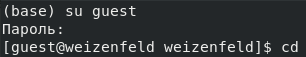{ #fig:001 width=70% }

Проверил атрибуты файла. (рис. [-@fig:002])

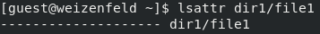{ #fig:002 width=70% }

Установил права `600` для этого файла. (рис. [-@fig:003])

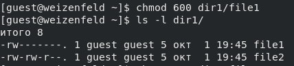{ #fig:003 width=70% }

Попытался установить аттрибут `a`. У не-администратора нет прав на это. (рис. [-@fig:004])

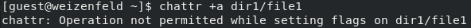{ #fig:004 width=70% }

Вошел на другом окне терминала от корневого пользователя. Здесь попытка успешна.. (рис. [-@fig:005])

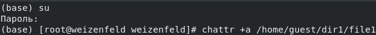{ #fig:005 width=70% }

Проверил установку атрибута от пользователя `guest`. (рис. [-@fig:006])

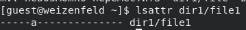{ #fig:006 width=70% }

Выполнил дозапись в файл. (рис. [-@fig:007])

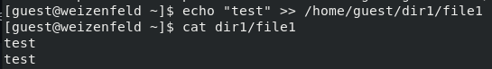{ #fig:007 width=70% }

Попробовал выполнить переименование, перезапись контента, смену атрибутов и прав на файл. Все безуспешно. (рис. [-@fig:008])
По всей видимости, специальный атрибут `a` позволяет всем пользователям (включая владельца) только
дозаписывать в этот файл (a - append).

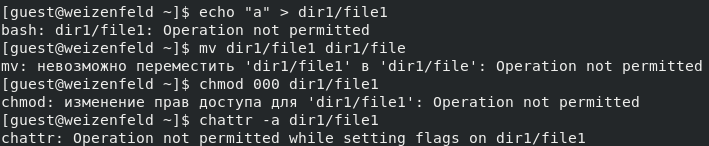{ #fig:008 width=70% }

После снятия специального атрибута (рис. [-@fig:009]), у файла не осталось причин для необычного поведения. (рис. [-@fig:010])

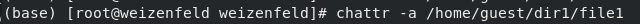{ #fig:009 width=70% }

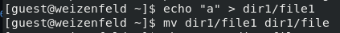{ #fig:010 width=70% }

Файл теперь с названием `file`, что указывает на успешное переименование ранее.

Поставил специальный атрибут `i`. (рис. [-@fig:011]).

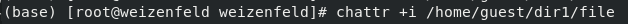{ #fig:011 width=70% }

После этого, все как с атрибутом `a`, за исключением невозможности так же и добавлять в файл. (рис. [-@fig:012])

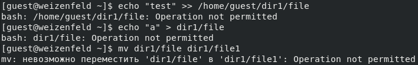{ #fig:012 width=70% }

# Выводы

В результате выполнения работы повысил свои навыки использования интерфейса командой строки (CLI), познакомился на примерах с тем,
как используются расширенные атрибуты при разграничении доступа.

# Список литературы{.unnumbered}

::: {#refs}
:::
