---
## Front matter
lang: ru-RU
title: Отчёт по лабораторной работе №5
subtitle: Дискреционное разграничение прав в Linux. Исследование влияния дополнительных атрибутов
author:
  - Вейценфельд Д. А.
institute:
  - Российский университет дружбы народов, Москва, Россия
date: 01 октября 2022

## i18n babel
babel-lang: russian
babel-otherlangs: english

## Formatting pdf
toc: false
toc-title: Содержание
slide_level: 2
aspectratio: 169
section-titles: true
theme: metropolis
header-includes:
 - \metroset{progressbar=frametitle,sectionpage=progressbar,numbering=fraction}
 - '\makeatletter'
 - '\beamer@ignorenonframefalse'
 - '\makeatother'
---

## Цель

Изучение механизмов изменения идентификаторов, применения
SetUID- и Sticky-битов. Получение практических навыков работы в консоли с 
дополнительными атрибутами. Рассмотрение работы механизма
смены идентификатора процессов пользователей, а также влияние бита
Sticky на запись и удаление файлов.

## SetUID- и SetGID-биты

- Являются "заменой" обычным битам на право выполнения (`x`)
файла
- Имеют обозначения `s`, через `ls -l` отображаются на месте бита `x` пользователя или группы соответственно.
- Позволяют выполнить файл любому пользователю от лица владельца файла или группы владельца соответсвенно

## Программа для проверки uid и gid

:::::::::::::: {.columns align=center}
::: {.column width="40%"}

- Написана программа для проверки ID
- Верно определяет как действительный так и мнимый UID и GID

:::
::: {.column width="60%"}

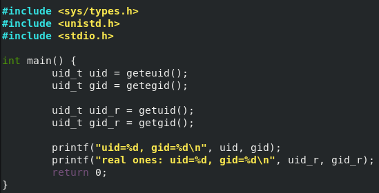

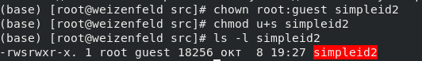

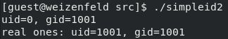

:::
::::::::::::::

## Программа для чтения фалов

:::::::::::::: {.columns align=center}
::: {.column width="60%"}

- Аналогична `cat`
- Нужна для установки на ней бита SUID

:::
::: {.column width="40%"}

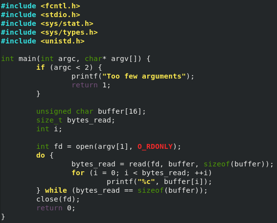

:::
::::::::::::::

## Проверка SUID-бита

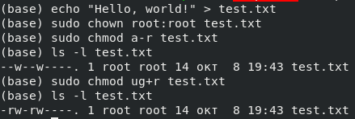

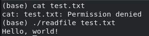

## Проверка SUID-бита

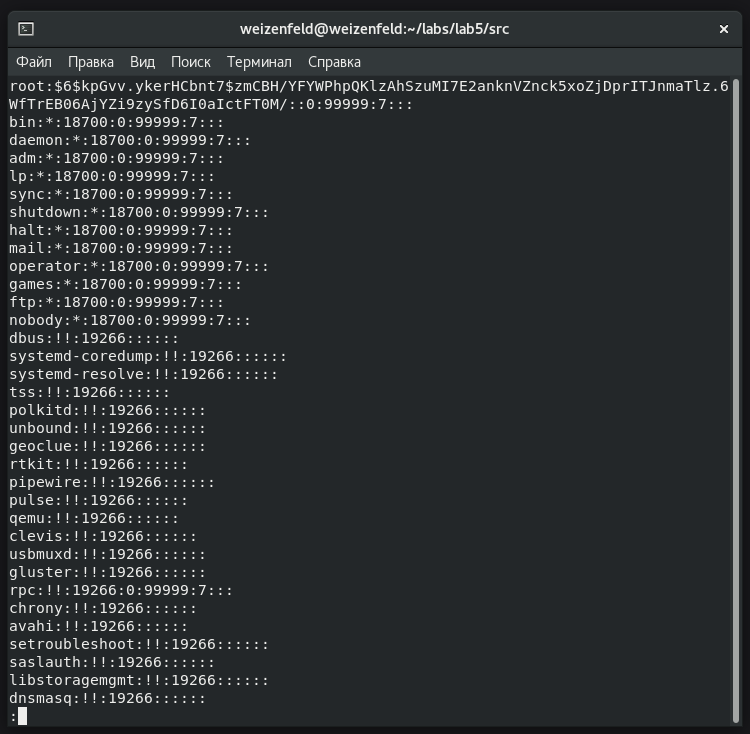

## Sticky-бит

:::::::::::::: {.columns align=center}
::: {.column width="30%"}

- Если он установлен для папки, то файлы в этой папке могут быть удалены только их владельцем. 
- Пример использования этого бита в операционной системе это системная папка `/tmp`.
- 
:::
::: {.column width="70%"}

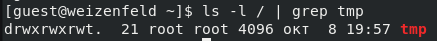

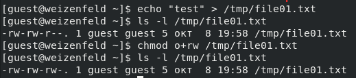

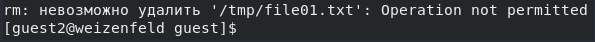

:::
::::::::::::::

## Sticky-бит

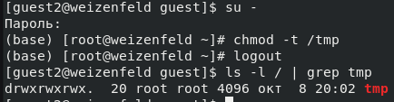

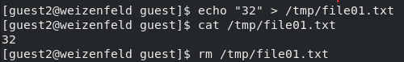

## Вывод

Изучены механизмы изменения идентификаторов, применения
SetUID- и Sticky-битов. Получены практические навыки работы в консоли с 
дополнительными атрибутами. Рассмотрена работа механизма
смены идентификатора процессов пользователей, а также влияние бита
Sticky на запись и удаление файлов.
