---
## Front matter
title: "Отчёт по лабораторной работе №5"
subtitle: "Дискреционное разграничение прав в Linux. Исследование влияния дополнительных атрибутов"
author: "Даниил Анатольевич Вейценфельд"

## Generic otions
lang: ru-RU
toc-title: "Содержание"

## Bibliography
bibliography: bib/cite.bib
csl: pandoc/csl/gost-r-7-0-5-2008-numeric.csl

## Pdf output format
toc: true # Table of contents
toc-depth: 2
lof: true # List of figures
lot: true # List of tables
fontsize: 12pt
linestretch: 1.5
papersize: a4
documentclass: scrreprt
## I18n polyglossia
polyglossia-lang:
  name: russian
  options:
	- spelling=modern
	- babelshorthands=true
polyglossia-otherlangs:
  name: english
## I18n babel
babel-lang: russian
babel-otherlangs: english
## Fonts
mainfont: PT Serif
romanfont: PT Serif
sansfont: PT Sans
monofont: PT Mono
mainfontoptions: Ligatures=TeX
romanfontoptions: Ligatures=TeX
sansfontoptions: Ligatures=TeX,Scale=MatchLowercase
monofontoptions: Scale=MatchLowercase,Scale=0.9
## Biblatex
biblatex: true
biblio-style: "gost-numeric"
biblatexoptions:
  - parentracker=true
  - backend=biber
  - hyperref=auto
  - language=auto
  - autolang=other*
  - citestyle=gost-numeric
## Pandoc-crossref LaTeX customization
figureTitle: "Рис."
tableTitle: "Таблица"
listingTitle: "Листинг"
lofTitle: "Список иллюстраций"
lotTitle: "Список таблиц"
lolTitle: "Листинги"
## Misc options
indent: true
header-includes:
  - \usepackage{indentfirst}
  - \usepackage{float} # keep figures where there are in the text
  - \floatplacement{figure}{H} # keep figures where there are in the text
---

# Цель работы

Изучение механизмов изменения идентификаторов, применения
SetUID- и Sticky-битов. Получение практических навыков работы в консоли с 
дополнительными атрибутами. Рассмотрение работы механизма
смены идентификатора процессов пользователей, а также влияние бита
Sticky на запись и удаление файлов.

# Задание

1. Создать программу для проверки uid и gid
2. Протестировать ее от имени разных пользователей 
3. Протестировать ее с разными правами доступаи и SUID/SGID-битами
4. Создать программу для чтения файла
5. Протестировать ее на файлах с разными правами доступа и SUID/SGID-битами
6. Протестировать sticky-бит

# Теоретическое введение

SetUID- и SetGID-биты (они же SUID, SGID) являются "заменой" обычным битам на право выполнения (`x`)
файла; имеют обозначения `s`, через `ls -l` отображаются
на месте бита `x` пользователя или группы соответственно.

Эти биты позволяют выполнить файл любому пользователю от лица владельца файла.
Для примера: программа `sudo` имеет влазельца root и SUID бит, значит любой пользователь может ее выполнить от лица root.

Sticky Bit - если он установлен для папки, то файлы в этой папке могут быть удалены только их владельцем. Пример использования этого бита в операционной системе это системная папка `/tmp`. Эта папка разрешена на запись любому пользователю, но удалять файлы в ней могут только пользователи, являющиеся владельцами этих файлов.

Теорию работы в *nix-системах см. в [@gnu-doc:bash;@newham:2005:bash;@zarrelli:2017:bash;@robbins:2013:bash;@tannenbaum:arch-pc:ru;@tannenbaum:modern-os:ru].

# Выполнение лабораторной работы

## SetUID, SetGID

С помощью языка Си и компилятора gcc создана (рис. [-@fig:001]) простая программа для проверки uid и gid исполняющего пользователя (рис. [-@fig:002]).

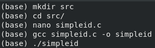{ #fig:001 width=70% }

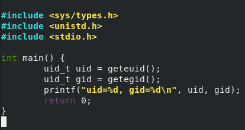{ #fig:002 width=70% }

Программа верно определила id пользователя guest (рис. [-@fig:008]).
Команда `id` возвращает ту же информацию.

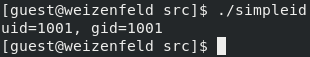{ #fig:008 width=70% }

Немного усложним программу для получения как отображаемых, так и реальных ID (рис. [-@fig:003]).

{ #fig:003 width=70% }

Установим ей владельца `root` и SUID-бит (рис. [-@fig:004]).

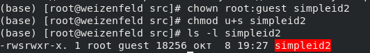{ #fig:004 width=70% }

Проверим, что она выводит для пользователя `guest`: рис. [-@fig:005].

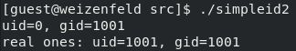{ #fig:005 width=70% }

Установим ей и SGID-бит вместе с группой root. Информация верна. (suid-бит был ранее снят) (рис. [-@fig:009])

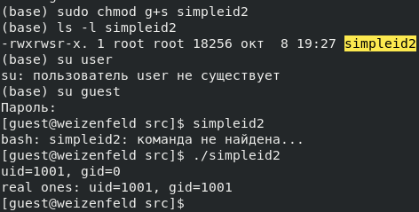{ #fig:009 width=70% }

Теперь напишем программу, которая читает файл как `cat` (рис. [-@fig:006]).

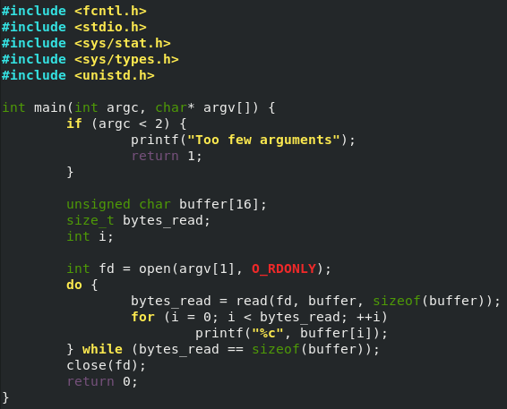{ #fig:006 width=70% }

Создадим текстовый файл с правами на чтение и запись тоьлко для root (рис. [-@fig:007]).

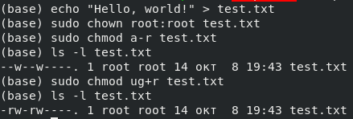{ #fig:007 width=70% }

Проверим чтение с помощью `cat` и с помощью программы (рис. [-@fig:010]).
Программе ранее был установлен бит SUID.

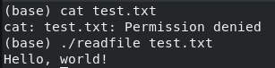{ #fig:010 width=70% }

Также, удалось считать файл `/etc/shadow` с помощью `./readfile /etc/shadow | less` (рис. [-@fig:011]).

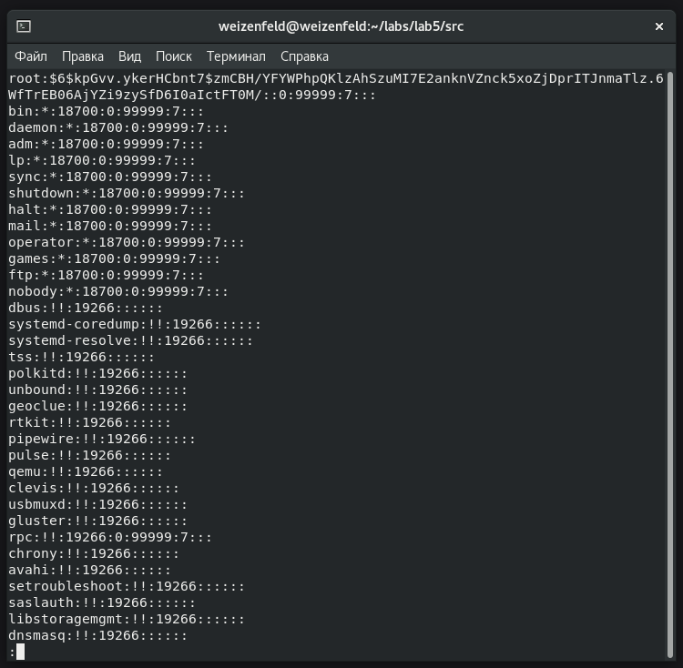{ #fig:011 width=70% }

## Sticky-бит

Проверим его наличие на директории `/tmp` (рис. [-@fig:012]).

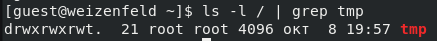{ #fig:012 width=70% }

Создадим там файл с правами на чтение/запись для всех (рис. [-@fig:013]).

{ #fig:013 width=70% }

Теперь попробуем чтение, запись и дозапись от другого пользователя.
Все успешно. Но удалить файл нельзя (рис. [-@fig:014]).

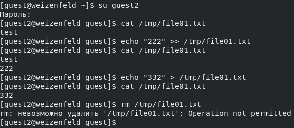{ #fig:014 width=70% }

Уберем от пользователя `root` sticky-бит с директории `/tmp` (рис. [-@fig:015]).

{ #fig:015 width=70% }

Файл так же можно читать/записывать, но теперь можно и удалить (рис. [-@fig:016]).

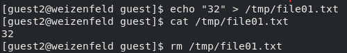{ #fig:016 width=70% }

# Выводы

Изучены механизмы изменения идентификаторов, применения
SetUID- и Sticky-битов. Получены практические навыки работы в консоли с 
дополнительными атрибутами. Рассмотрена работа механизма
смены идентификатора процессов пользователей, а также влияние бита
Sticky на запись и удаление файлов.

# Список литературы{.unnumbered}

::: {#refs}
:::
