---
## Front matter
lang: ru-RU
title: Отчёт по лабораторной работе №6
subtitle: Мандатное разграничение прав в Linux
author:
  - Вейценфельд Д. А.
institute:
  - Российский университет дружбы народов, Москва, Россия
date: 01 октября 2022

## i18n babel
babel-lang: russian
babel-otherlangs: english

## Formatting pdf
toc: false
toc-title: Содержание
slide_level: 2
aspectratio: 169
section-titles: true
theme: metropolis
header-includes:
 - \metroset{progressbar=frametitle,sectionpage=progressbar,numbering=fraction}
 - '\makeatletter'
 - '\beamer@ignorenonframefalse'
 - '\makeatother'
---

## Цель

Развить навыки администрирования ОС Linux. Получить первое практическое знакомство с технологией SELinux.
Проверить работу SELinx на практике совместно с веб-сервером Apache

## Enforcing, targeted

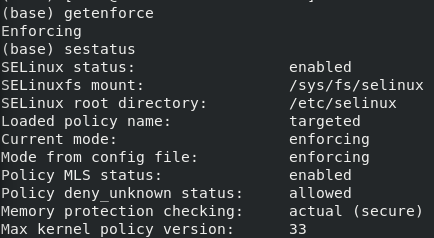{ #fig:001 width=70% }

## Запуск Apache Web Server

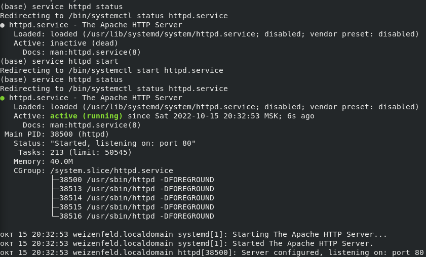{ #fig:002 width=80% }

## Контекст безопасности

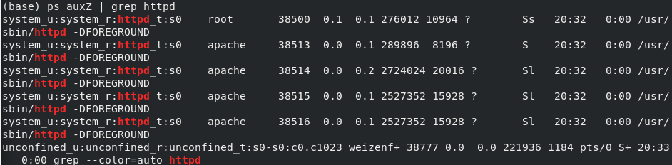{ #fig:003 width=90% }

## Переключатели SELinux для httpd

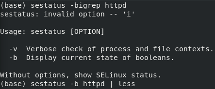{ #fig:004 width=70% }

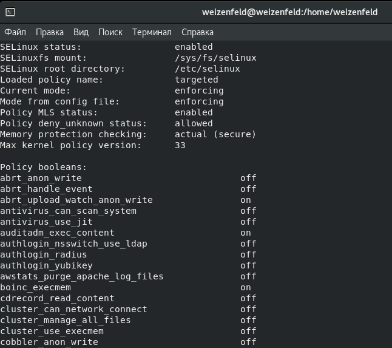{ #fig:005 width=80% }

## Политика SELinux

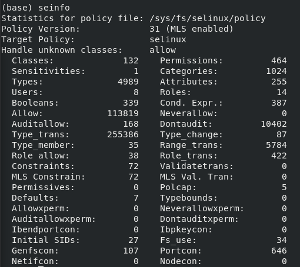{ #fig:006 width=70% }

## /var/www

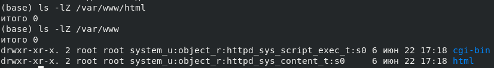{ #fig:007 width=90% }

## Тестовый статичный файл

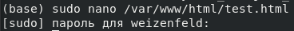{ #fig:008 width=70% }

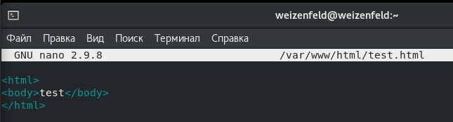{ #fig:009 width=70% }

## Контекст файлов в www

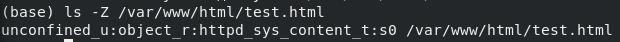{ #fig:010 width=80% }

## Тест веб-сервера

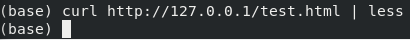{ #fig:011 width=70% }

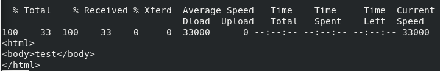{ #fig:012 width=80% }

## Контексты для httpd

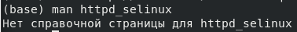{ #fig:013 width=70% }

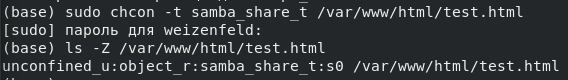{ #fig:014 width=70% }

## Контексты для httpd

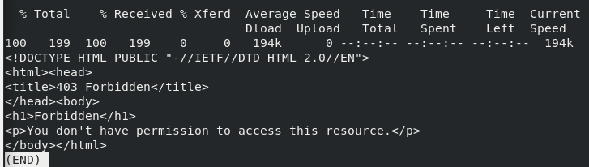{ #fig:015 width=80% }

## Контексты для httpd

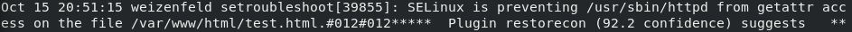{ #fig:016 width=90% }

## Управление портами в SELinux

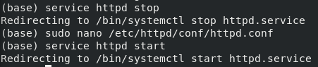{ #fig:017 width=70% }

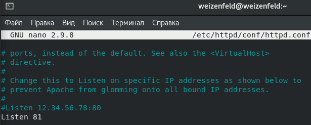{ #fig:018 width=70% }

## Управление портами в SELinux

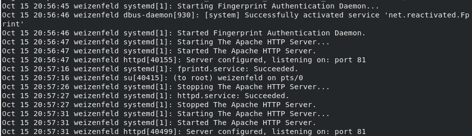{ #fig:019 width=90% }

## Управление портами в SELinux

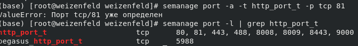{ #fig:020 width=70% }

## Управление портами в SELinux

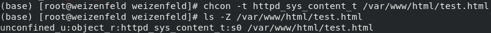{ #fig:021 width=80% }

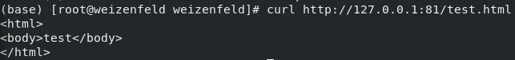{ #fig:022 width=70% }

## Управление портами в SELinux

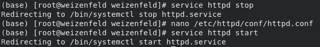{ #fig:023 width=70% }

## Управление портами в SELinux

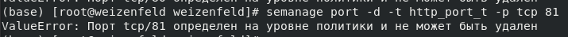{ #fig:024 width=80% }
