---
## Front matter
title: "Отчёт по лабораторной работе №6"
subtitle: "Мандатное разграничение прав в Linux"
author: "Даниил Анатольевич Вейценфельд"

## Generic otions
lang: ru-RU
toc-title: "Содержание"

## Bibliography
bibliography: bib/cite.bib
csl: pandoc/csl/gost-r-7-0-5-2008-numeric.csl

## Pdf output format
toc: true # Table of contents
toc-depth: 2
lof: true # List of figures
lot: true # List of tables
fontsize: 12pt
linestretch: 1.5
papersize: a4
documentclass: scrreprt
## I18n polyglossia
polyglossia-lang:
  name: russian
  options:
	- spelling=modern
	- babelshorthands=true
polyglossia-otherlangs:
  name: english
## I18n babel
babel-lang: russian
babel-otherlangs: english
## Fonts
mainfont: PT Serif
romanfont: PT Serif
sansfont: PT Sans
monofont: PT Mono
mainfontoptions: Ligatures=TeX
romanfontoptions: Ligatures=TeX
sansfontoptions: Ligatures=TeX,Scale=MatchLowercase
monofontoptions: Scale=MatchLowercase,Scale=0.9
## Biblatex
biblatex: true
biblio-style: "gost-numeric"
biblatexoptions:
  - parentracker=true
  - backend=biber
  - hyperref=auto
  - language=auto
  - autolang=other*
  - citestyle=gost-numeric
## Pandoc-crossref LaTeX customization
figureTitle: "Рис."
tableTitle: "Таблица"
listingTitle: "Листинг"
lofTitle: "Список иллюстраций"
lotTitle: "Список таблиц"
lolTitle: "Листинги"
## Misc options
indent: true
header-includes:
  - \usepackage{indentfirst}
  - \usepackage{float} # keep figures where there are in the text
  - \floatplacement{figure}{H} # keep figures where there are in the text
---

# Цель работы

Развить навыки администрирования ОС Linux. Получить первое практическое знакомство с технологией SELinux.
Проверить работу SELinx на практике совместно с веб-сервером Apache

# Выполнение

1. Войдите в систему с полученными учётными данными и убедитесь, что
SELinux работает в режиме enforcing политики targeted с помощью команд getenforce и sestatus.

Все выставлено верно. (рис. [-@fig:001])

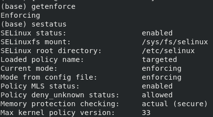{ #fig:001 width=70% }

2. Обратитесь с помощью браузера к веб-серверу, запущенному на вашем
компьютере, и убедитесь, что последний работает:
`service httpd status` или `/etc/rc.d/init.d/httpd status`
Если не работает, запустите его так же, но с параметром start.

Запуск успешен. (рис. [-@fig:002])

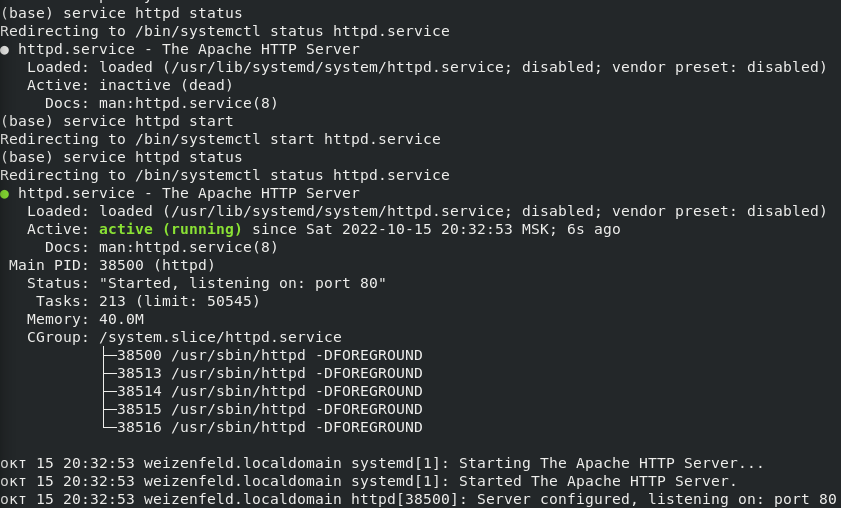{ #fig:002 width=80% }

3. Найдите веб-сервер Apache в списке процессов, определите его контекст
безопасности и занесите эту информацию в отчёт. Например, можно использовать команду
`ps auxZ | grep httpd` или `ps -eZ | grep httpd`

`system_u:system_r:http_t:s0` (рис. [-@fig:003])

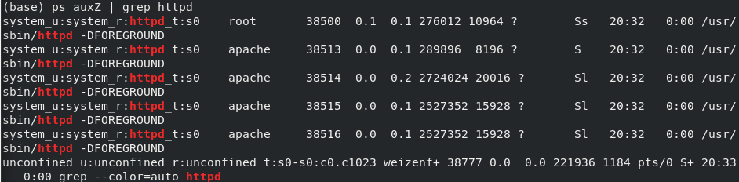{ #fig:003 width=90% }

4. Посмотрите текущее состояние переключателей SELinux для Apache с
помощью команды
`sestatus -bigrep httpd`
Обратите внимание, что многие из них находятся в положении «off».

Данная команда неверна. Использовал другую (рис. [-@fig:004]).

Вывод верный, согласно заданию (рис. [-@fig:005]).

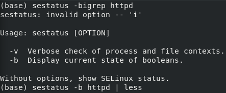{ #fig:004 width=70% }

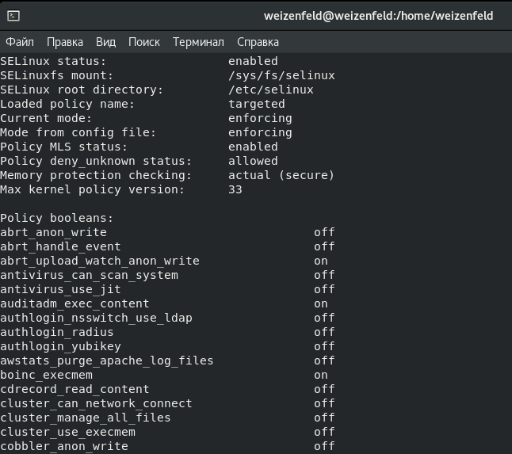{ #fig:005 width=80% }

5. Посмотрите статистику по политике с помощью команды seinfo, также
определите множество пользователей, ролей, типов.

8, 14, 4989 (рис. [-@fig:006])

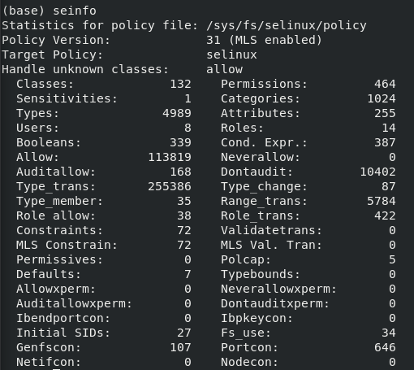{ #fig:006 width=70% }

6. Определите тип файлов и поддиректорий, находящихся в директории
`/var/www`, с помощью команды `ls -lZ /var/www`

7. Определите тип файлов, находящихся в директории /var/www/html:
`ls -lZ /var/www/html`

`html` (директория для статичных файлов для http-запросов) пуста.
Ее сосед - `cgi-bin`, предположительно, является директорией для бинарных файлов обработки запросов (контекстов http) (рис. [-@fig:007])

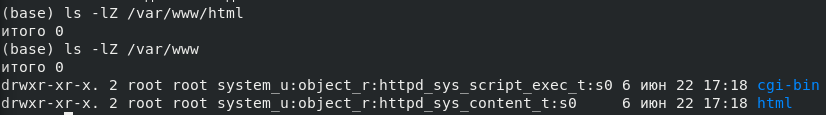{ #fig:007 width=90% }

8. Определите круг пользователей, которым разрешено создание файлов в
директории `/var/www/html`.

Только `root`, согласно рис. [-@fig:007].

1. Создайте от имени суперпользователя html-файл
`/var/www/html/test.html` следующего содержания:

```html
<html>
<body>test</body>
</html>
```

Создан. (рис. [-@fig:008], [-@fig:009])

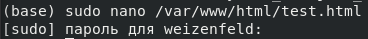{ #fig:008 width=70% }

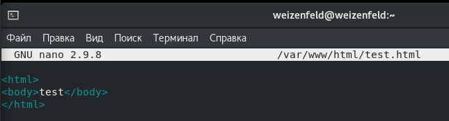{ #fig:009 width=70% }

10. Проверьте контекст созданного вами файла. Занесите в отчёт контекст,
присваиваемый по умолчанию вновь созданным файлам в директории
`/var/www/html`.

`httpd_sys_content_t` (рис. [-@fig:010])

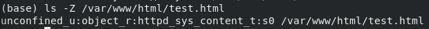{ #fig:010 width=80% }

11. Обратитесь к файлу через веб-сервер, введя в браузере адрес
`http://127.0.0.1/test.html`. Убедитесь, что файл был успешно отображён.

Обращение - рис. [-@fig:011], ответ - рис. [-@fig:012]

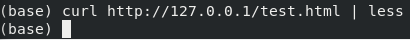{ #fig:011 width=70% }

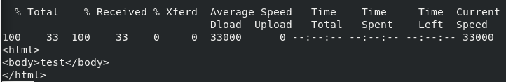{ #fig:012 width=80% }

12. Изучите справку `man httpd_selinux` и выясните, какие контексты файлов определены для `httpd`. Сопоставьте их с типом файла
`test.html`. Проверить контекст файла можно командой `ls -`Z.
`ls -Z /var/www/html/test.html`

Справка `httpd_selinux` отсутсвует в дистрибутиве (рис. [-@fig:013]). Используется тот, что предложен в первой лабораторной.

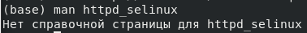{ #fig:013 width=70% }

13.  Измените контекст файла `/var/www/html/test.html` с
httpd_sys_content_t на любой другой, к которому процесс httpd не
должен иметь доступа, например, на samba_share_t:
`chcon -t samba_share_t /var/www/html/test.html`
`ls -Z /var/www/html/test.html`

Контекст успешно изменен (рис. [-@fig:014]).

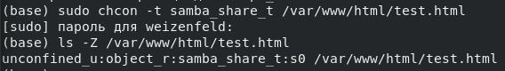{ #fig:014 width=70% }

14. Попробуйте ещё раз получить доступ к файлу через веб-сервер, введя в
браузере адрес `http://127.0.0.1/test.html`. Вы должны получить
сообщение об ошибке:
Forbidden
You don't have permission to access `/test.html` on this server.

Все так. (рис. [-@fig:015])

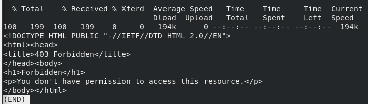{ #fig:015 width=80% }

15. Проанализируйте ситуацию. Почему файл не был отображён, если права
доступа позволяют читать этот файл любому пользователю?
`ls -l /var/www/html/test.html`
Просмотрите log-файлы веб-сервера Apache. Также просмотрите системный лог-файл:
`tail /var/log/messages`
Если в системе окажутся запущенными процессы setroubleshootd и
audtd, то вы также сможете увидеть ошибки, аналогичные указанным
выше, в файле `/var/log/audit/audit.log`. Проверьте это утверждение самостоятельно.

В файле /var/log/messages видно, что SELinux блокирует доступ к файлу `test.html` процессу httpd.
(([-@fig:016]))

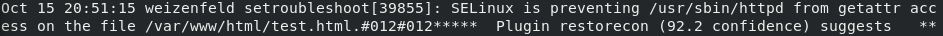{ #fig:016 width=90% }

16. Попробуйте запустить веб-сервер Apache на прослушивание ТСР-порта
81 (а не 80, как рекомендует IANA и прописано в `/etc/services`). Для
этого в файле `/etc/httpd/httpd.conf` найдите строчку Listen 80 и
замените её на Listen 81.

Остановлен сервер (рис. [-@fig:017]), изменен конфиг (рис. [-@fig:018]) и снова запущен сервер (рис. [-@fig:017])

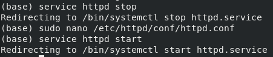{ #fig:017 width=70% }

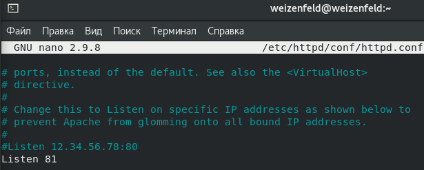{ #fig:018 width=70% }

17. Выполните перезапуск веб-сервера Apache. Произошёл сбой? Поясните
почему?

Нет. Все порты открыты, порт 81 не занят.

18. Проанализируйте лог-файлы:
`tail -nl /var/log/messages`
Просмотрите файлы `/var/log/http/error_log`,
`/var/log/http/access_log` и `/var/log/audit/audit.log` и
выясните, в каких файлах появились записи.

Сервер запустился без ошибок. (рис. [-@fig:019])

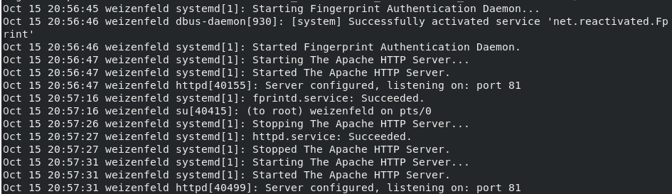{ #fig:019 width=90% }

19. Выполните команду
`semanage port -a -t http_port_t -р tcp 81`
После этого проверьте список портов командой
`semanage port -l | grep http_port_t`
Убедитесь, что порт 81 появился в списке.

Он там и так был (рис. [-@fig:020]). Это так же является причиной, почему сервер спокойно запустился.

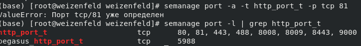{ #fig:020 width=70% }

20. Попробуйте запустить веб-сервер Apache ещё раз. Поняли ли вы, почему
он сейчас запустился, а в предыдущем случае не смог?

Стало понятно, почему он **мог не** запуститься.

21. Верните контекст `httpd_sys_cоntent__t` к файлу `/var/www/html/test.html`:
`chcon -t httpd_sys_content_t /var/www/html/test.html`
После этого попробуйте получить доступ к файлу через веб-сервер, введя в браузере адрес `http://127.0.0.1:81/test.html`.
Вы должны увидеть содержимое файла — слово «test».

Контекст возвращен (рис. [-@fig:021]). Ответ на запрос верный (рис. [-@fig:022]).

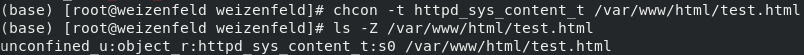{ #fig:021 width=80% }

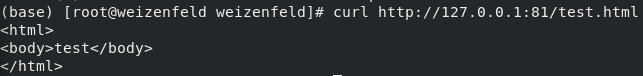{ #fig:022 width=70% }

22.  Исправьте обратно конфигурационный файл apache, вернув Listen 80.

Исправлен. (рис. [-@fig:023])

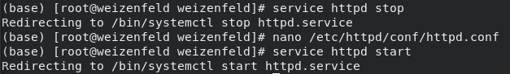{ #fig:023 width=70% }

23. Удалите привязку http_port_t к 81 порту:
semanage port -d -t http_port_t -p tcp 81
и проверьте, что порт 81 удалён.

Порт 81 определен на уровне политики системы. Здесь он не может быть удален. (рис. [-@fig:024])

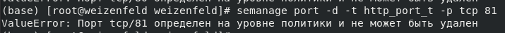{ #fig:024 width=80% }

24. Удалите файл `/var/www/html/test.html`:
`rm /var/www/html/test.html`

Успешно. (рис. [-@fig:025])

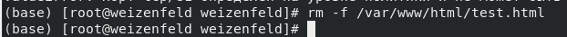{ #fig:025 width=70% }

# Вывод

Развили навыки администрирования ОС Linux. Получили первое практическое знакомство с технологией SELinux.
Проверили работу SELinx на практике совместно с веб-сервером Apache
