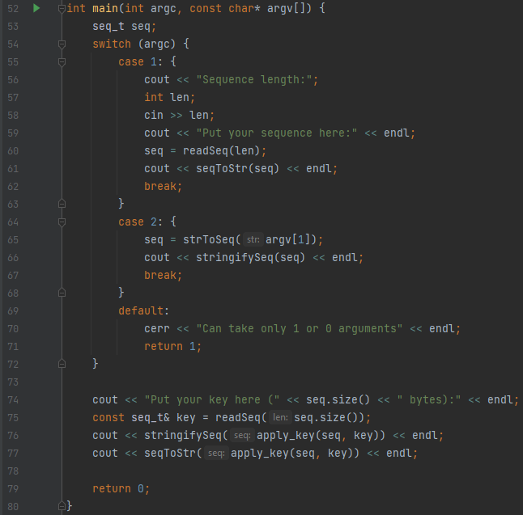

---
## Front matter
lang: ru-RU
title: Отчёт по лабораторной работе №7
subtitle: Элементы криптографии. Однократное гаммирование
author:
  - Вейценфельд Д. А.
institute:
  - Российский университет дружбы народов, Москва, Россия
date: 01 октября 2022

## i18n babel
babel-lang: russian
babel-otherlangs: english

## Formatting pdf
toc: false
toc-title: Содержание
slide_level: 2
aspectratio: 169
section-titles: true
theme: metropolis
header-includes:
 - \metroset{progressbar=frametitle,sectionpage=progressbar,numbering=fraction}
 - '\makeatletter'
 - '\beamer@ignorenonframefalse'
 - '\makeatother'
---

## Цель

Освоить на практике применение режима однократного гаммирования

## Однократное гаммирование

```sh
# Ключ
05 0C 17 7F 0E 4E 37 D2 94 10 09 2E 22 57 FF C8 0B B2 70 54
# Сообщение
# Штирлиц – Вы Герой!!
D8 F2 E8 F0 EB E8 F6 20 2D 20 C2 FB 20 C3 E5 F0 EE E9 21 21
# Шифр
DD FE FF 8F E5 A6 C1 F2 B9 30 CB D5 02 94 1A 38 E5 5B 51 75
```


## Однократное гаммирование

```sh
# Шифр
DD FE FF 8F E5 A6 C1 F2 B9 30 CB D5 02 94 1A 38 E5 5B 51 75
# Неверный ключ
05 0C 17 7F 0E 4E 37 D2 94 10 09 2E 22 55 F4 D3 07 BB BC 54
# Полученный текст
# Штирлиц - Вы Болван!
D8 F2 E8 F0 EB E8 F6 20 2D 20 C2 FB 20 C1 EE EB E2 E0 ED 21
```

## Программа для шифрования

:::::::::::::: {.columns align=center}
::: {.column width="50%"}

{ height=100% }

:::
::: {.column width="50%"}


:::
::::::::::::::

## Программа для шифрования

```cpp
typedef vector<uint8_t> seq_t;

seq_t apply_key(const seq_t& seq, const seq_t& key) {
    seq_t res;
    for (size_t i = 0; i < seq.size(); ++i)
        res.push_back(seq.at(i) ^ key.at(i));
    return res;
}
```

## Программа для шифрования


## Программа для шифрования


## Вывод

Освоили на практике применение режима однократного гаммирования
