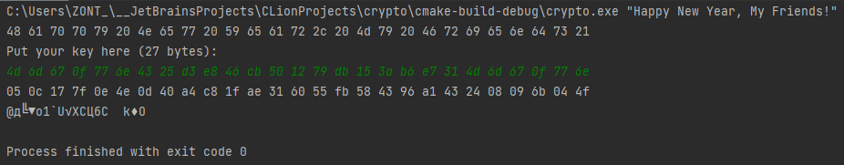
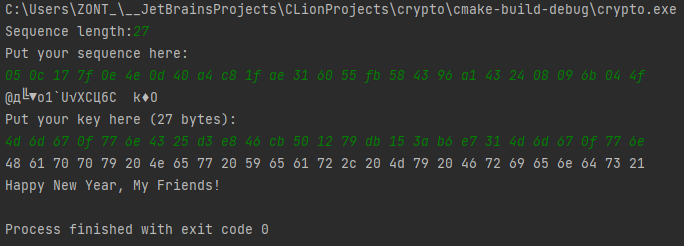
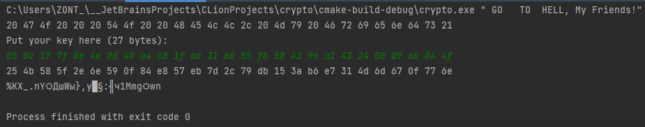
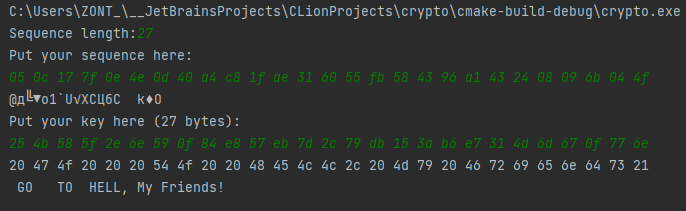
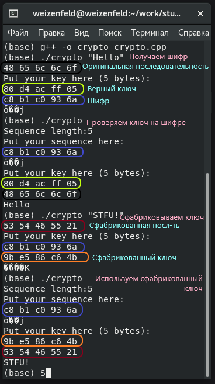

---
## Front matter
title: "Отчёт по лабораторной работе №7"
subtitle: "Элементы криптографии. Однократное гаммирование"
author: "Даниил Анатольевич Вейценфельд"

## Generic otions
lang: ru-RU
toc-title: "Содержание"

## Bibliography
bibliography: bib/$C_i$te.bib
csl: pandoc/csl/gost-r-7-0-5-2008-numeric.csl

## Pdf output format
toc: true # Table of contents
toc-depth: 2
lof: true # List of figures
lot: true # List of tables
fontsize: 12pt
linestretch: 1.5
papersize: a4
documentclass: scrreprt
## I18n polyglossia
polyglossia-lang:
  name: russian
  options:
	- spelling=modern
	- babelshorthands=true
polyglossia-otherlangs:
  name: english
## I18n babel
babel-lang: russian
babel-otherlangs: english
## Fonts
mainfont: PT Serif
romanfont: PT Serif
sansfont: PT Sans
monofont: PT Mono
mainfontoptions: Ligatures=TeX
romanfontoptions: Ligatures=TeX
sansfontoptions: Ligatures=TeX,Scale=MatchLowercase
monofontoptions: Scale=MatchLowercase,Scale=0.9
## Biblatex
biblatex: true
biblio-style: "gost-numeric"
biblatexoptions:
  - parentracker=true
  - backend=biber
  - hyperref=auto
  - language=auto
  - autolang=other*
  - $C_i$testyle=gost-numeric
## Pandoc-crossref LaTeX customization
figureTitle: "Рис."
tableTitle: "Таблица"
listingTitle: "Листинг"
lofTitle: "Список иллюстраций"
lotTitle: "Список таблиц"
lolTitle: "Листинги"
## Misc options
indent: true
header-includes:
  - \usepackage{indentfirst}
  - \usepackage{float} # keep figures where there are in the text
  - \floatplacement{figure}{H} # keep figures where there are in the text
---

# Цель работы

Освоить на практике применение режима однократного гаммирования

## Теоретическое введение

Предложенная Г. С. Вернамом так называемая «схема однократного использования (гаммирования)» является простой, но надёжной схемой шифрования данных.

Гаммирование представляет собой наложение (снятие) на открытые (зашифрованные) данные последовательности элементов других данных, полученной с помощью некоторого криптографического алгоритма, для получения зашифрованных (открытых) данных. Иными словами, наложение
гаммы — это сложение её элементов с элементами открытого (закрытого)
текста по некоторому фиксированному модулю, значение которого представляет собой известную часть алгоритма шифрования.

В соответствии с теорией криптоанализа, если в методе шифрования используется однократная вероятностная гамма (однократное гаммирование)
той же длины, что и подлежащий сокрытию текст, то текст нельзя раскрыть.
Даже при раскрытии части последовательности гаммы нельзя получить информацию о всём скрываемом тексте.

Наложение гаммы по сути представляет собой выполнение операции
сложения по модулю 2 (XOR) (обозначаемая знаком ⊕) между элементами
гаммы и элементами подлежащего сокрытию текста. Напомним, как работает операция XOR над битами: 0 ⊕ 0 = 0, 0 ⊕ 1 = 1, 1 ⊕ 0 = 1, 1 ⊕ 1 = 0.

Такой метод шифрования является симметричным, так как двойное прибавление одной и той же величины по модулю 2 восстанавливает исходное
значение, а шифрование и расшифрование выполняется одной и той же программой.

Если известны ключ и открытый текст, то задача нахождения шифротекста заключается в применении к каждому символу открытого текста следующего правила:

$$
C_i = P_i ⊕ K_i
$$

где $C_i$ — i-й символ получившегося зашифрованного послания, $P_i$ — i-й
символ открытого текста, $K_i$ — i-й символ ключа, i = 1, m. Размерности
открытого текста и ключа должны совпадать, и полученный шифротекст
будет такой же длины.

Если известны шифротекст и открытый текст, то задача нахождения
ключа решается также в соответствии с формулой выше, а именно, обе части равенства необходимо сложить по модулю 2 с $P_i$:

$$
C_i ⊕ P_i = P_i ⊕ K_i ⊕ P_i = K_i,
K_i = C_i ⊕ P_i
$$

Открытый текст имеет символьный вид, а ключ — шестнадцатеричное
представление. Ключ также можно представить в символьном виде, воспользовавшись таблицей ASCII-кодов.

К. Шеннон доказал абсолютную стойкость шифра в случае, когда однократно используемый ключ, длиной, равной длине исходного сообщения,
является фрагментом истинно случайной двоичной последовательности с
равномерным законом распределения. Криптоалгоритм не даёт никакой информации об открытом тексте: при известном зашифрованном сообщении
C все различные ключевые последовательности K возможны и равновероятны, а значит, возможны и любые сообщения P.

Необходимые и достаточные условия абсолютной стойкости шифра:
– полная случайность ключа;
– равенство длин ключа и открытого текста;
– однократное использование ключа.

Рассмотрим пример. Ключ Центра:

```
05 0C 17 7F 0E 4E 37 D2 94 10 09 2E 22 57 FF C8 0B B2 70 54
```

Сообщение центра:

```
Штирлиц – Вы Герой!!
D8 F2 E8 F0 EB E8 F6 20 2D 20 C2 FB 20 C3 E5 F0 EE E9 21 21
```

Зашифрованный текст, находящийся у Мюллера:

```
DD FE FF 8F E5 A6 C1 F2 B9 30 CB D5 02 94 1A 38 E5 5B 51 75
```

Дешифровальщики попробовали ключ:

```
05 0C 17 7F 0E 4E 37 D2 94 10 09 2E 22 55 F4 D3 07 BB BC 54
```

и получили текст:

```
D8 F2 E8 F0 EB E8 F6 20 2D 20 C2 FB 20 C1 EE EB E2 E0 ED 21
Штирлиц - Вы Болван!
```

Другие ключи дадут лишь новые фразы, пословицы, стихотворные
строфы, словом, всевозможные тексты заданной длины.

# Задание

Нужно подобрать ключ, чтобы получить сообщение «С Новым Годом,
друзья!». Требуется разработать приложение, позволяющее шифровать и
дешифровать данные в режиме однократного гаммирования. Приложение
должно:

1. Определить вид шифротекста при известном ключе и известном открытом тексте.
2. Определить ключ, с помощью которого шифротекст может быть преобразован в некоторый фрагмент текста, представляющий собой один из возможных вариантов прочтения открытого текста.

Теорию работы в *nix-системах см. в [@gnu-doc:bash;@newham:2005:bash;@zarrelli:2017:bash;@robbins:2013:bash;@tannenbaum:arch-pc:ru;@tannenbaum:modern-os:ru].

## Выполнение

Написана программа со следующим функционалом:

- Запуск без аргументов
  - Предлагается ввести код сообщения (оригинальный, либо зашифрованный)
  - Предлагается ввести ключ
  - Выводится зашифрованный/расшифрованный код сообщения и само сообщение (нечитаемое, если зашифровано)
- Запуск с одним аргументом
  - Аргумент является сообщением
  - Предлагается ввести ключ
  - Выводится зашифрованный код сообщения и строка этого кода (нечитаемый)

Сообщения нужно вводить символами, присутсвующими в стандартной кодировке ASCII.
Сделано так потому, что кодировка по умолчанию везде UTF-8, а из под чистого C++ с
ней работать сложно, плюс желательно иметь один байт на один символ для удобного
обращения с ключами и шифрами при работе с программой.

Поэтому, вместо указанного в задании сообщения `С Новым Годом, друзья!`
будет использовано `Happy New Year, My Friends!`. В качестве
альтернативного сообщения - ` GO   TO  HELL, My Friends!`

Для того, что бы выполнить задание, нужно:

1. Зашифровать сообщение (рис. [-@fig:001]). Для проверки, можно его расшифровать этим же ключом (рис. [-@fig:002])

{ #fig:001 width=90% }

{ #fig:002 width=80% }

2. Зашифровать новое сообщение (той же длины), используя зашифрованное из п.1 (рис. [-@fig:003]). Полученный шифр - новый ключ.

{ #fig:003 width=90% }

3. Использовать этот ключ для расшифровывания сообщения из п.1 (рис. [-@fig:004]). Выводится новое сообщение, хоть мы и расшифровываем первое.

{ #fig:004 width=80% }

Код программы:

```cpp
#include <iostream>
#include <vector>
#include <sstream>
#include <iomanip>
#include <cstring>

using namespace std;

// Последовательность (сообщение/ключ/шифр) - вектор байтов
typedef vector<uint8_t> seq_t;

// Применение ключа к последовательности
seq_t apply_key(const seq_t& seq, const seq_t& key) {
    seq_t res;
    for (size_t i = 0; i < seq.size(); ++i)
        res.push_back(seq.at(i) ^ key.at(i));
    return res;
}

// Конвертация строки в последовательность (сообщение)
seq_t strToSeq(const char* str) {
    seq_t res;
    for (int i = 0; i < strlen(str); ++i)
        res.push_back(str[i]);
    return res;
}

// Конвертация последовательности в строку (сообщение)
char* seqToStr(const seq_t& seq) {
    char* res = new char[seq.size() + 1];
    for (size_t i = 0; i < seq.size(); ++i)
        res[i] = (char) seq.at(i);
    res[seq.size()] = 0;
    return res;
}

// Отображение последовательности как строки
string stringifySeq(const seq_t& seq) {
    stringstream ss;
    ss << hex << setfill('0');
    for (const auto& item: seq)
        ss << setw(2) << ((int) item) << " ";
    return ss.str();
}

// Читать последовательность заданной длины из stdin
seq_t readSeq(size_t len) {
    seq_t res;
    unsigned x;
    string s;
    for (size_t i = 0; i < len; ++i) {
        cin >> hex >> x;
        res.push_back(x);
    }
    return res;
}

int main(int argc, const char* argv[]) {
    seq_t seq;
    switch (argc) {
        case 1: {
            // Читаем сообщение в виде последовательности
            cout << "Sequence length:";
            int len;
            cin >> len;
            cout << "Put your sequence here:" << endl;
            seq = readSeq(len);
            cout << seqToStr(seq) << endl;
            break;
        }
        case 2: {
            // Берем сообщение из аргумента программы
            seq = strToSeq(argv[1]);
            cout << stringifySeq(seq) << endl;
            break;
        }
        default:
            cerr << "Can take only 1 or 0 arguments" << endl;
            return 1;
    }

    // Читаем ключ
    cout << "Put your key here (" << seq.size() << " bytes):" << endl;
    const seq_t& key = readSeq(seq.size());
    // Выводим шифр/расшифровку
    cout << stringifySeq(apply_key(seq, key)) << endl;
    // Выводим как строку (если шифр - нечитаема, если расшифровка - читаема)
    cout << seqToStr(apply_key(seq, key)) << endl;

    return 0;
}
```

Проверка программы на виртуальной машине: рис. [-@fig:005]

На первых скриншотах использован компилятор Visual Studio, на ВМ - gnu compiler collection.

{ #fig:005 width=70% }

## Вывод

Освоили на практике применение режима однократного гаммирования
