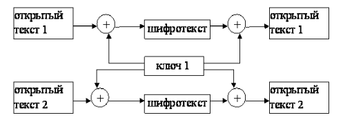
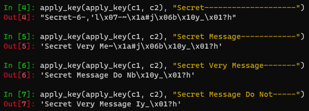

---
## Front matter
lang: ru-RU
title: Отчёт по лабораторной работе №8
subtitle: Элементы криптографии. Шифрование (кодирование) различных исходных текстов одним ключом
author:
  - Вейценфельд Д. А.
institute:
  - Российский университет дружбы народов, Москва, Россия
date: 01 октября 2022

## i18n babel
babel-lang: russian
babel-otherlangs: english

## Formatting pdf
toc: false
toc-title: Содержание
slide_level: 2
aspectratio: 169
section-titles: true
theme: metropolis
header-includes:
 - \metroset{progressbar=frametitle,sectionpage=progressbar,numbering=fraction}
 - '\makeatletter'
 - '\beamer@ignorenonframefalse'
 - '\makeatother'
---

## Цель

Освоить на практике применение режима однократного гаммирования
на примере кодирования различных исходных текстов одним ключом.

## Кодирование одним ключом



## Кодирование одним ключом

- Недостатки
  - Если узнать ключ - все сообщения можно прочитать
  - Если узнать хотя бы часть одного из сообщений, можно узнать эту же часть у всех остальных
  - Если узнать хотя бы одно целое сообщение - обнаруживается ключ
- Преимущества
  - Простейший алгоритм

## Программа

```py
def apply_key(p, k):
    if len(p) != len(k):
        raise ValueError('p and k must have equal sizes!')
    c = []
    for pi, ki in zip(p, k):
        c.append(chr(ord(pi) ^ ord(ki)))
    return ''.join(c)
```

## Алгоритм открытия сообщений

$$
C_1 ⊕ C_2 ⊕ P_1 = P_2
$$



## Контрольные вопросы

- Как, зная один из текстов ($P_1$ или $P_2$), определить другой, не зная при
этом ключа?
- Что будет при повторном использовании ключа при шифровании текста?
- Как реализуется режим шифрования однократного гаммирования одним
ключом двух открытых текстов?
- Перечислите недостатки шифрования одним ключом двух открытых
текстов.
- Перечислите преимущества шифрования одним ключом двух открытых
текстов.

## Вывод

Освоили на практике применение режима однократного гаммирования
на примере кодирования различных исходных текстов одним ключом.
