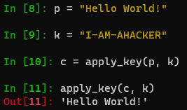
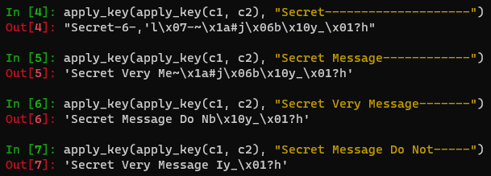

---
## Front matter
title: "Отчёт по лабораторной работе №8"
subtitle: "Элементы криптографии. Шифрование (кодирование) различных исходных текстов одним ключом"
author: "Даниил Анатольевич Вейценфельд"

## Generic otions
lang: ru-RU
toc-title: "Содержание"

## Bibliography
bibliography: bib/cite.bib
csl: pandoc/csl/gost-r-7-0-5-2008-numeric.csl

## Pdf output format
toc: true # Table of contents
toc-depth: 2
lof: true # List of figures
lot: true # List of tables
fontsize: 12pt
linestretch: 1.5
papersize: a4
documentclass: scrreprt
## I18n polyglossia
polyglossia-lang:
  name: russian
  options:
	- spelling=modern
	- babelshorthands=true
polyglossia-otherlangs:
  name: english
## I18n babel
babel-lang: russian
babel-otherlangs: english
## Fonts
mainfont: PT Serif
romanfont: PT Serif
sansfont: PT Sans
monofont: PT Mono
mainfontoptions: Ligatures=TeX
romanfontoptions: Ligatures=TeX
sansfontoptions: Ligatures=TeX,Scale=MatchLowercase
monofontoptions: Scale=MatchLowercase,Scale=0.9
## Biblatex
biblatex: true
biblio-style: "gost-numeric"
biblatexoptions:
  - parentracker=true
  - backend=biber
  - hyperref=auto
  - language=auto
  - autolang=other*
  - citestyle=gost-numeric
## Pandoc-crossref LaTeX customization
figureTitle: "Рис."
tableTitle: "Таблица"
listingTitle: "Листинг"
lofTitle: "Список иллюстраций"
lotTitle: "Список таблиц"
lolTitle: "Листинги"
## Misc options
indent: true
header-includes:
  - \usepackage{indentfirst}
  - \usepackage{float} # keep figures where there are in the text
  - \floatplacement{figure}{H} # keep figures where there are in the text
---

# Цель работы

Освоить на практике применение режима однократного гаммирования
на примере кодирования различных исходных текстов одним ключом.

## Задание

Два текста кодируются одним ключом (однократное гаммирование).
Требуется не зная ключа и не стремясь его определить, прочитать оба текста. Необходимо разработать приложение, позволяющее шифровать и дешифровать тексты $P_1$ и $P_2$ в режиме однократного гаммирования. Приложение должно определить вид шифротекстов $C_1$ и $C_2$ обоих текстов $P_1$ и
$P_2$ при известном ключе; Необходимо определить и выразить аналитически способ, при котором злоумышленник может прочитать оба текста, не
зная ключа и не стремясь его определить.

# Выполнение

## Программа

В этот раз для простоты выполнения использован язык `Python`.
В качестве программы будет выступать одна-единственная функция.

В интеркативном режиме `ipython` написана эта функция для складывания двух строк операцией XOR.

```py
def apply_key(p, k):
    if len(p) != len(k):
        raise ValueError('p and k must have equal sizes!')
    c = []
    for pi, ki in zip(p, k):
        c.append(chr(ord(pi) ^ ord(ki)))
    return ''.join(c)
```

Проверим ее работу: рис. [-@fig:001]

{ #fig:001 width=70% }

## Разгадывание текста

Составлен способ прочитать два закодированных текста, зная небольшой регион одного из них.

Пусть сообщение 1 - `Secret Message Do Not Read`,
сообщение 2 - `Secret Very Message It Is!`;
Оба закодированы, но известны первые два слова сообщения 1.

Тогда, можно использовать формулу (1):

$$
C_1 ⊕ C_2 ⊕ P_1 = P_2
$$

где $C_{1,2}$ - шифротекст сообщений, $P_1$ - частичный текст сообщения 1,
где известный регион написан и находится на нужном месте, а остальные символы - произвольны.
$P_2$ - Часть сообщения 2, где достоверны символы на месте известных из сообщения 1.

Благодаря этой формуле, можно открыть в первый раз неизвестную часть сообщения 2.
Если попытаться дописать обрезаные слова и использовать снова формулу (1),
можно открыть новый регион на сообщении 1, и так до конца.

В нашем случае (рис. [-@fig:002]) удается дойти до слов `Secret Message Do Not`
в первом и `Secret Very Message I` во втором. Далее идти невозможно, т.к. нельзя угадать,
какое именно слово может начинатсья с `I`.

{ #fig:002 width=70% }

## Вывод

Освоили на практике применение режима однократного гаммирования
на примере кодирования различных исходных текстов одним ключом.
